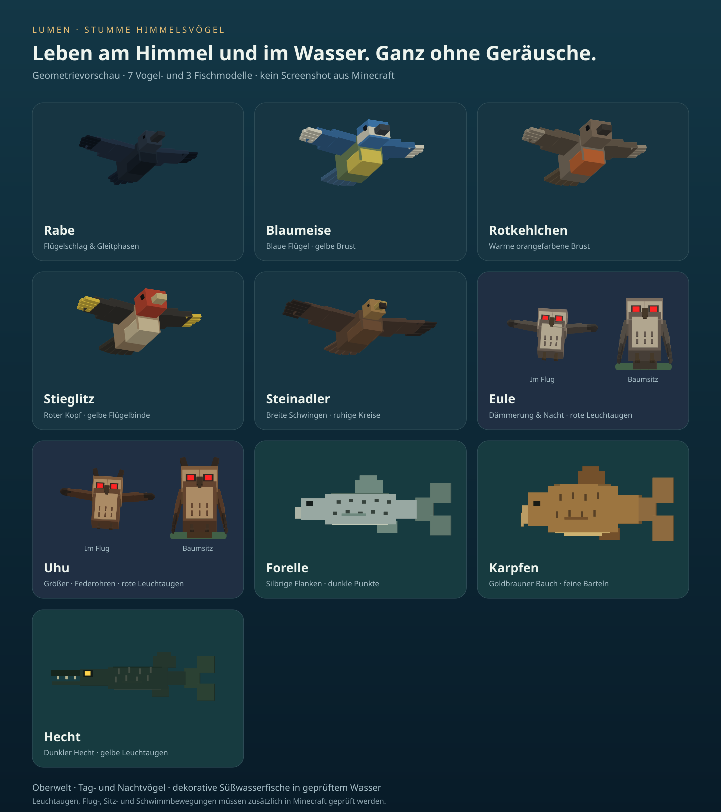

# minecraft-addons · Lumen Stumme Himmelsvögel

Optionales Vogel-Add-on für Minecraft Bedrock unter Windows, **Testversion 0.1.0**. Es ergänzt Raben, Blaumeisen, Rotkehlchen, Stieglitze und einen kreisenden Steinadler. Die Vögel sind dekorativ und erhalten keine Geräusche. Das Add-on funktioniert eigenständig. Das optionale Lumen-Grafikpaket wird im separaten Repository [minecraft-look](https://github.com/dr-dimitri/minecraft-look) entwickelt; eine gemeinsame Nutzung ist vorbereitet und muss im Spiel noch geprüft werden.

**Lokal geprüft, noch nicht in Minecraft ausgeführt.** Auf diesem Mac stehen Minecraft für Windows und die RX 9060 XT nicht zur Verfügung. Import, Animationen, Geräuschfreiheit im Spiel und Bildrate sind daher noch auf dem Ziel-PC zu prüfen. Die Modelle sind bewusst im kantigen Minecraft-Stil gestaltet; es sind keine fotorealistischen Tiermodelle.



## Installieren

1. `dist/Lumen-Silent-Birds-0.1.0.mcaddon` auf den Windows-PC übertragen und mit **Minecraft für Windows** öffnen. Das Archiv enthält ein Ressourcenpaket und ein Verhaltenspaket.
2. Zunächst eine Testwelt öffnen bzw. deren Einstellungen über das Stiftsymbol aufrufen.
3. Unter **Verhaltenspakete → Meine Pakete** „Lumen · Stumme Himmelsvögel“ aktivieren. Unter **Ressourcenpakete → Aktiv** kontrollieren, dass auch das zugehörige Ressourcenpaket aktiv ist; bei Bedarf ebenfalls aktivieren.
4. Für die erste Prüfung nur die beiden Vogelpakete aktivieren. Ein zusätzliches Grafikpaket ist optional; dessen Mindestversion und Installationsanleitung gelten unabhängig.
5. Die Welt betreten und tagsüber an eine freie Stelle gehen. Innerhalb von etwa fünf Sekunden sollte eine Gruppe erscheinen. Nicht direkt unter einem Dach oder einer Baumkrone testen.

Das Vogel-Add-on benötigt zusätzlich zum Ressourcenpaket das Verhaltenspaket in der jeweiligen Welt. Es verwendet die stabile Script API 2.0.0, die seit Bedrock 1.21.90 verfügbar ist. Im Manifest steht deshalb `[1,21,90]` als technische Mindestversion. Das Add-on fordert keine Experimente und führt keine Cheats oder Konsolenbefehle aus. Die genaue Menübeschriftung kann mit Minecraft-Updates abweichen.

Zum Ausschalten beide Vogelpakete in den Welteinstellungen deaktivieren. Es gibt noch keinen eigenen Vogelregler im Grafikstil-Menü.

## Was am Himmel passiert

| Vogel | Aussehen und Flug |
|---|---|
| Zwei Raben | Dunkle blau-schwarze Federn, kräftiger Schnabel, Flügelschläge im Wechsel mit kurzen Gleitphasen. |
| Blaumeise | Blaue Flügel, gelbe Brust und heller Kopfstreifen; schnelle Flügelschläge. |
| Rotkehlchen | Orangefarbene Brust und braunes Gefieder; kleiner, lebhafter Flug. |
| Stieglitz | Roter Kopf und gelbe Flügelzeichnung; schnelle Flügelschläge. |
| Ein Steinadler | Braunes Gefieder, goldener Kopf, breite Schwingen mit einzelnen Federspitzen; weite Kreise über den kleineren Vögeln. |

Eine Gruppe besteht aus sechs Vögeln. Nahe Spieler teilen sich eine Gruppe; höchstens drei Gruppen bzw. **18 gleichzeitig geladene Vögel** werden durch den Controller erzeugt. Vögel entstehen nur tagsüber in der Oberwelt, zwischen Tageszeit-Tick 500 und 11500. Bei Nacht werden aktive Vögel entfernt; Nether und Ende erhalten keine Schwärme. Regen wird in dieser Version noch nicht gesondert berücksichtigt.

Die Flugbahnen bleiben an einem festen Ort in der Landschaft. Die Vögel verfolgen den Spieler nicht. Bei Ortswechsel, Dimensionswechsel oder Verlassen der Welt wird aufgeräumt. Eine Gruppe lebt höchstens 45 Sekunden und kann danach ersetzt werden. Es kann dadurch einen sichtbaren Wechsel geben. Felsüberhänge, Gebäude oder nicht geladene Bereiche können dazu führen, dass weniger Vögel erscheinen oder ein Vogel vorzeitig verschwindet.

Die Vögel haben keine Angriffe, Zähmung, Beute, Erfahrungspunkte oder Fortpflanzung. Sie verändern keine Blöcke. Es sind zusätzliche Entitäten, deshalb ist das Add-on mehr als eine reine Shader-Einstellung. Eigene Geräuschdateien, Sound-Ereignisse und geerbte Papageien-Geräusche sind nicht enthalten; andere Minecraft-Geräusche werden nicht stummgeschaltet.

## Leistung und technische Grenzen

Die Modelle bestehen aus wenigen Quadern und verwenden je eine 64 × 16 Pixel große Farbpalette. Die Flügel bewegen sich durch clientseitige Molang-Animationen. Ein Skript setzt Flugposition und Blickrichtung mit kleinen `tryTeleport`-Schritten pro Spieltick. Ob der Bedrock-Client diese Schritte ausreichend flüssig darstellt, ist Teil der noch offenen Sichtprüfung.

Alle fünf Sekunden prüft der Controller Spielernähe, freie Bereiche und verwaiste Vögel. Er erzeugt keine Ticking Areas und lädt keine Chunks absichtlich nach. Zusätzlich entfernt ein nativer 60-Sekunden-Timer Vögel, wenn das Skript ausfällt. Dieser Timer zählt nur, während die Entität simuliert wird. Entitäten in entladenen Chunks sind weder vollständig zählbar noch sofort entfernbar; nach dem Laden werden sie vom Controller entfernt. Das Limit von 18 bezieht sich deshalb auf geladene Entitäten.

Das Ziel von ungefähr 80 FPS bei WQHD auf der RX 9060 XT 16 GB bleibt ein **Messziel**, kein bestätigtes Ergebnis. Anleitung für die ausstehende Prüfung: [VALIDATION.md](docs/VALIDATION.md).

## Selbst bauen

Python ab 3.10 und Node.js ab 20 für die Tests. Keine zusätzlichen Bibliotheken, kein `npm install` und kein Netzwerk beim Build nötig.

```text
python scripts/generate.py
npm test
python -m unittest discover -s tests -v
python scripts/build.py
```

Unter Windows kann `py -3` statt `python` verwendet werden. Der Build erzeugt das `.mcaddon`, ein eigenständig nutzbares Quellcode-ZIP und SHA-256-Prüfsummen in `dist/`. Die Archive haben feste Zeitstempel und werden bei unverändertem Quellstand bytegleich gebaut.

`src/` enthält den Flugcontroller. `scripts/generate.py` pflegt Modelle, Farbpaletten, Flügelanimationen, Manifest und Entitätskomponenten. `behavior_pack/` und `resource_pack/` werden daraus erzeugt; direkte Änderungen dort werden beim Build ersetzt. `docs/PREVIEW.svg` wird aus derselben Modellgeometrie gerendert, mit vereinfachter Beleuchtung und einer festen Flügelpose. UUIDs bei Updates beibehalten und für einen neuen Releasekandidaten die Versionsnummer in Generator und `package.json` synchron erhöhen.

Die eigene Repository-CI prüft das Add-on unabhängig vom Grafikprojekt. Tags nach `birds-vX.Y.Z` erzeugen nach erfolgreicher Prüfung einen Release-Entwurf; die Windows-Abnahme bleibt ein eigener Schritt. Projektvorgaben: [AGENTS.md](AGENTS.md), Änderungen: [CHANGELOG.md](CHANGELOG.md), Releaseleitfaden: [RELEASING.md](docs/RELEASING.md). Das eigenständig baubare Source-ZIP enthält auch diese Dokumente, die Abnahmevorlage und die [Lizenz](LICENSE).

## Technische Quellen

- [Stabile Script API 2.0.0 in Bedrock 1.21.90](https://www.minecraft.net/it-it/article/minecraft-1-21-90-bedrock-changelog)
- [Pack-Manifest und Script-Abhängigkeiten](https://learn.microsoft.com/minecraft/creator/reference/content/addonsreference/packmanifest?view=minecraft-bedrock-stable)
- [Dimension: Entitäten und Geländeabfragen](https://learn.microsoft.com/en-us/minecraft/creator/scriptapi/minecraft/server/dimension?view=minecraft-bedrock-stable), [Entity](https://learn.microsoft.com/en-us/minecraft/creator/scriptapi/minecraft/server/entity?view=minecraft-bedrock-stable), [TeleportOptions](https://learn.microsoft.com/en-us/minecraft/creator/scriptapi/minecraft/server/teleportoptions?view=minecraft-bedrock-stable)
- [Clientseitige Animationen](https://learn.microsoft.com/en-us/minecraft/creator/documents/animations/animationsoverview?view=minecraft-bedrock-stable)
- [Timer](https://learn.microsoft.com/en-us/minecraft/creator/reference/content/entityreference/examples/entitycomponents/minecraftcomponent_timer?view=minecraft-bedrock-stable), [Instant Despawn](https://learn.microsoft.com/en-us/minecraft/creator/reference/content/entityreference/examples/entitycomponents/minecraftcomponent_instant_despawn?view=minecraft-bedrock-stable), [Damage Sensor](https://learn.microsoft.com/en-us/minecraft/creator/reference/content/entityreference/examples/entitycomponents/minecraftcomponent_damage_sensor?view=minecraft-bedrock-stable)
